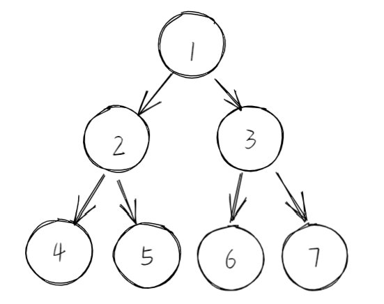
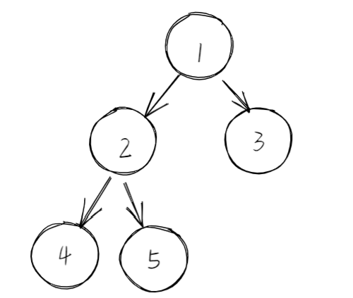
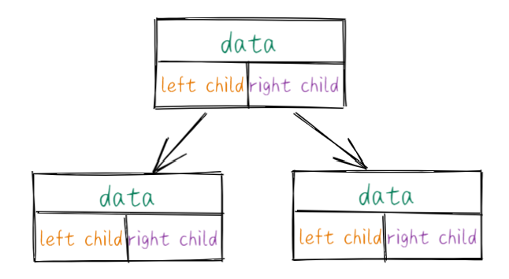
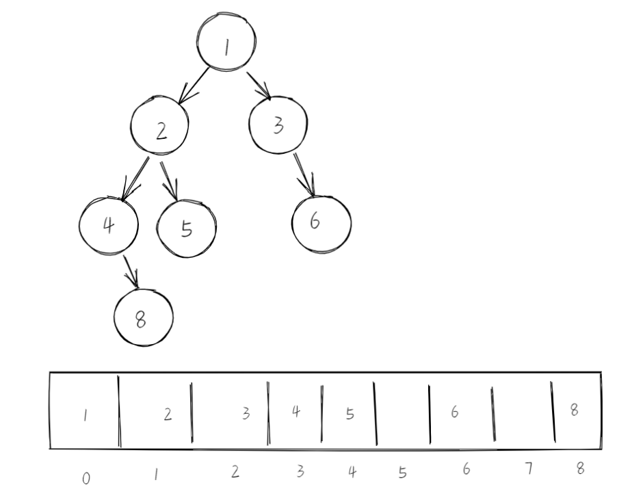
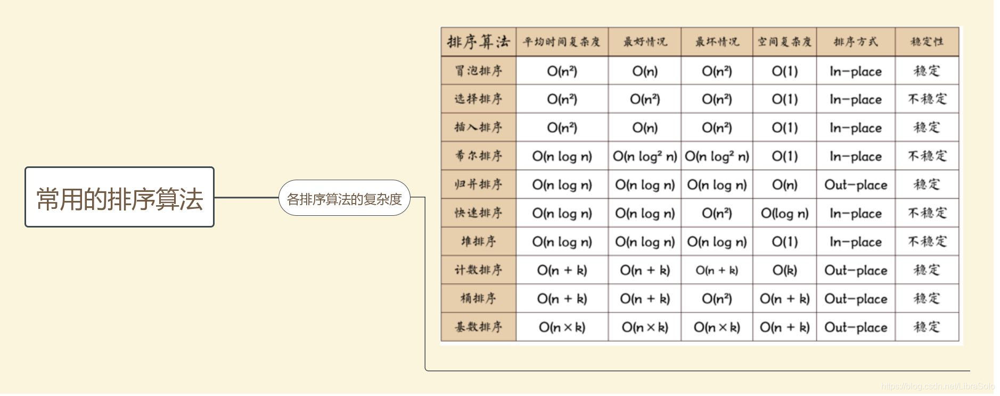

# Python_算法相关笔记

**大学没有好好学习算法，前来修补**

此文根据 **漫画算法：小灰的算法之旅  魏梦舒** 学习记录，后续继续补充学习。

# 算法概述

## 什么是算法

在我看来，**算法** 是根据一系列的 **规则** 进行简便运算。

例如 '高斯算法'：从1加到10000，可以一个一个慢慢来，也可以用等差数列求和。答案是相同的，只是过程有好坏快慢。在计算机领域，衡量算法的重要标准有两个：

1. 时间复杂度
2. 空间复杂度

## 算法的实际应用

理论知识固然容易，但是还是需要结合实际来运用，常用的场景：

1. 数学运算	（加减乘除，最大公约数，最小公倍数....）
2. 查找		（SQL或者爬虫获取数据）
3. 排序		（杂乱数据按照大小排序）
4. 最优决策	（迷宫的最短路线，怎么花工资....）
5. 面试		（当然这个必不可少，面试一问算法就天天写冒泡排序）🤣

## 什么是数据结构

每次提到算法，肯定会涉及到数据结构。

在我看来，**数据结构** 是一个容器，把多个数据存放的方式。算法相当于把这个容器里的东西怎么整理，怎么拿出来，对此基础上进行操作。

数据结构的组成方式：

1. 线性结构		（数组、链表、栈、队列、哈希表）
2. 树			（代表性的是：二叉树、红黑树、二叉堆）
3. 图			（多对多的关系，较为复杂的数据结构）
4. 等等...		（有基础的数据结构变换而来）

# 数据结构基础

## 数组和链表

物理结构	内存中实际存在的储存结构

### 什么是数组

**Python中没有 数组 ，用列表可以代替**。
[Python_列表](http://mucunliangtai.com/index.php/archives/33/) 笔记不再赘述，只记录觉得加深印象的概念。

数组的每一个元素都有自己的下表，可以顺序读取，或者按照标号读取。

数组在内存中是顺序储存，每一个元素都紧密排列，不能打乱元素的储存顺序。

### 什么是链表

链表类似于一条九节鞭，一个接着一个，中间断了，后续也就一起丢失了。

因为链表不仅存放 **自身数据**，而且存放**下一个数据的位置**，所以链表在内存中不是顺序储存，可以打乱顺序，只要有内存空间就可以储存。

### 数组和链表的对比


数组的优势：定位快、查找快

链表的优势：插入、删除快

## 栈和队列

逻辑结构，是一种抽象概念，依附于物理结构存在。

### 什么是栈

我们把几本书堆的很高，一本一本往上堆，当我们想拿出来的时候，也只能从上面一个一个往外取。

栈：是一种 **线性结构**，它遵循 **先进后出** 原则（First In Last Out，简称FILO）。

最早进去的元素位置叫做 **栈底**，最后进去的元素位置叫做 **栈顶**。

栈可以由 **队列** 或 **链表** 实现。

#### 栈的操作

入栈（push）：把一个元素加入栈中，只允许元素从栈顶一侧放入。

出栈（pop）：把一个元素弹出栈，只允许元素从栈顶一侧弹出。

### 什么是队列

排队做核酸，来的时候只能在队伍尾巴排队，离开时都要在检测口离开，不允许插队。

队列：是一种 **线性结构**，它遵循 **先进先出** 原则（First In First Out，简称FIFO）。

队列的入口处叫 **队尾**，队列的出口处叫 **队头**。

队列可以由 **队列** 或 **链表** 实现。

#### 队列的基本操作

入队（enqueue）：把一个元素加入到队列中，只允许放在队尾。

出队（dequeue）：把首个元素从队列中移，只允许队头离开。

**Python不涉及队列需要扩容,此次学习不深究。**

### 栈和队列的应用

栈的输出顺序和输入顺序相反，所以栈通常用于对“历史”的**回溯**，也就是逆流而上追溯“历史”。

例如实现递归的逻辑，就可以用栈来代替，因为栈可以回溯方法的调用链。

队列的输出顺序和输入顺序相同，所以队列通常用于对“历史”的回放，也就是按照“历史”顺序，把“历史”**重演**一遍。

例如在多线程中，争夺公平锁的等待队列，就是按照访问顺序来决定线程在队列中的次序的。

### 双端队列（栈+队列）

**两端** 都可以 **入队 或 出队**。

既可以 先进先出，也可以 先进后出。

### 优先队列

优先级高的先出

优先队列不属于 **线性数据结构**，基于 **二叉堆**来实现的。

## 散列表（哈希表）

这种数据结构提供了 **键(key)** 和 **值(value)** 的映射关系。

时间复杂度接近O(1)。

这种数据结构像 **字典** 一样，说一个汉语，就可以有对应的翻译。

Python 哈希表详细解释[Python 哈希表](https://blog.csdn.net/YangStudent/article/details/123706327)

### 哈希函数

将哈希表中元素的键 (通常为String类型) 映射为数组下标的函数，获得数组下标后很容易获取数组的值。因为数组的取值是位置顺序，不好分辨。哈希函数就是将 键(字符串) 与值对应起来，方便查询。不同语言，哈希函数实现方式不一样，不深究。

#### 散列表的操作

在Python中，散列表的实现为 **字典**，[字典学习笔记](http://mucunliangtai.com/index.php/archives/37/)。

#### 哈希冲突

当遇到哈希函数通过不同的键获得相同的位置时，产生冲突。

常用的哈希冲突的解决方法有两种：开放地址法和链地址法。

开放地址法：当遇到冲突时，通过某种方法找到一个空闲位置插入。

**链地址法**：获得相同位置时，此位置不存数据，而是存数据的集合。

# 树

树（tree）是n（n≥0）个节点的有限集。当n=0时，称为空树。在任意一个非空树中，有如下特点。

1. 有且仅有一个特定的称为根的节点。
2. 当n>1时，其余节点可分为m（m>0）个互不相交的有限集，每一个集合本身又是一个树，并称为根的子树。
   下面这张图，就是一个标准的树结构。

## 二叉树

二叉树是树的一种特殊形式，其孩子节点最多有两个。左边叫左孩子(left child)，右边叫右孩子(right child)。

**满二叉树**：一个二叉树的所有非叶子节点都存在左右孩子，并且所有孩子在同一层级上。



**完全二叉树**：**满二叉树** 的一部分，这一部分必须是按照顺序的。



### 二叉树的物理结构

因为二叉树属于逻辑结构，所需需要一定的物理结构来实现。

1. 链式储存结构
2. 数组

#### 链式储存结构



#### 数组



使用数组存储时，会按照层级顺序把二叉树的节点放到数组中对应的位置上。如果某一个节点的左孩子或右孩子空缺，则数组的相应位置也空出来。

### 二叉树的应用

其最主要应用在于 **查找操作** 和 **维持相对顺序**

#### 查找

**二叉查找树(二叉排序树)**：在原二叉树基础上增加了以下条件：

1. 如果左子树不为空，则左子树上所有节点的值均小于根节点的值
2. 如果右子树不为空，则右子树上所有节点的值均小于根节点的值
3. 左、右子树也都是二叉查找树

**后续深究学习...**

## 二叉树的遍历

* 从节点之间位置关系，二叉树的遍历分为四种：

1. 前序遍历：根左右
2. 中序遍历：左根右
3. 后序遍历：左右根
4. 层序遍历

* 从宏观的角度来看，二叉树的遍历分两类：

1. 深度优先遍历（前序遍历，中序遍历，后序遍历）
2. 广度优先遍历（层序遍历）

## 二叉堆

二叉堆分为：最大堆 和 最小堆

二叉堆虽然是一个完全二叉树，但是它的存储结构是顺序结构，其所有节点存在数组中。

## 优先队列

队列：先进先出

优先队列：不在遵循先进先出，分以下两种情况

1. 最大优先队列，无论入队顺序如何，都是当前最大的元素优先出队
2. 最小优先队列，无论入队顺序如何，都是当前最小的元素优先出队

### 优先队列的实现

利用二叉堆进行排序：
最大堆或最小堆都可以获取最大元素或最小元素。

# 排序算法



## 冒泡排序

```python
# 冒泡排序
# 列表每两个相邻的数，如果前面比后面大，则交换这两个数
# 时间复杂度:O(n2)
def bubble_sort(li):
    for i in range(len(li) - 1):
        exchange = False
        for j in range(len(li) - i - 1):
            if li[j] > li[j + 1]:
                li[j], li[j + 1] = li[j + 1], li[j]
                exchange = True
        if not exchange:
            return
```

### 冒泡优化 鸡尾酒排序

冒泡是每次选取最大或者最小的数，n-1次循环。
鸡尾酒进行优化，最大和最小的数依次获取，然后循环。针对于大部分数据有序的数组，整理的速度快一些。

```python
def cocktail_sort(li):
    size = len(li)
    sign = True # 标记
    for i in range(size//2):
        if sign: # 判断是否还有可交换的元素
            sign = False
            for j in range(i, size - 1 - i):
                if li[j] > li[j + 1]:
                    li[j], li[j + 1] = li[j + 1], li[j]
            for k in range(size - 2 -i , i, -1 ):
                if li[k] < li[k - 1]:
                    li[k], li[k - 1] = li[k - 1], li[k]
                    sign = True
        else:
            return
```

## 快速排序 双边循环

```python
# 快排 双边循环
# 递归思想，找到一个基准，所有小的放在基本左边，大的都放在右边，递归后顺序
# 时间复杂度：最坏 n^2（逆序列），在最好 n（logn）。
def _quick_double(li, left, right):
    start = left
    pivot = li[start]
    while left != right:
        # 左侧只要小于 pivot,大于 pivot放在原位
        while left < right and li[right] > pivot:
            right -= 1
        # 右侧只大于 pivot,小于 pivot放在原位
        while left < right and li[left] <= pivot:
            left += 1
        li[left], li[right] = li[right], li[left]
    li[start], li[left] = li[left], li[start]
    return left


def quick_sort_double(li, left, right):
    if left >= right:
        return
    q = _quick_double(li, left, right)
    quick_sort_double(li, left, q-1)
    quick_sort_double(li, q+1, right)
```

### 快速排序 单边循环

```python
def quick_sort2(li, start, end):
    if start >= end:
        return
    pivot = li[start]
    right = end
    left = start
    # 控制right -= 1不满足条件交换
    while left < right:
        while left < right and li[right] > pivot:
            right -= 1

        li[left] = li[right]
        # 控制 left += 1 , 不满足条件交换
        while left < right and li[left] < pivot:
            left += 1
        li[right] = li[left]

    # 退出循环 left = right
    # left 或者 right 对应的位置 赋值为基准值
    li[left] = pivot
    # 递归
    quick_sort2(li, start, left - 1)  # 对左边排序
    quick_sort2(li, left + 1, end)  # 对右边排序
```

### 快速排序 非递归 用栈来实现

待补充😢

## 堆排序

利用最大堆-->从小到大排序
利用最小堆-->从大到小排序

```python
# 以最大堆获取 从小到大的有序排列为例
# 空间复杂度为 O(1)
# 时间复杂度为 O(nlogn)
def big_heap(li, start, end):
    # 最大堆
    root = start
    left = start * 2 + 1

    while left <= end:
        # 存在右子节点，且右子节点大于左子节点，则将左子节点变成右子节点的索引
        if left + 1 <= end and li[left] < li[left + 1]:
            left += 1
        if li[root] < li[left]:
            # 把大的放上面
            li[root], li[left] = li[left], li[root]
            # 存在孙节点，继续比较
            root = left
            left = root * 2 + 1
        else:
            break


def heap_sort(li):
    first = len(li) // 2 - 1
    for start in range(first, -1, -1):
        # 倒序调成，循环构建最大堆
        big_heap(li, start, len(li) - 1)
    for end in range(len(li) - 1, 0, -1):
        # 将堆顶和堆尾交换数据
        li[0], li[end] = li[end], li[0]
        # 重新调成最大堆
        big_heap(li, 0, end - 1)
    return
```

## 计数排序

例如从 0-9 生成20个随机数，统计0-9每个的次数，然后依次写下来就是有序的😂

在最大值和最小值相差不大时，用这个排序还是很快的

## 桶排序

类似计数排序，不过是生成几个区间，然后再对区间内部进行排序，再依次写下所有的桶

## 选择排序

```python
# 先从整个序列中选择最小的数据放到第一位，再从剩余的序列中选择最小的数据放在第二位，如此循环，直到最后一位。
# O(n2)
def select_sort_simple(li):
    li_new = []
    for i in range(len(li)):
        min_val = min(li)
        li_new.append(min_val)
        li.remove(min_val)
    return li_new

def select_sort(li):
    for i in range(len(li)-1):
        min_loc = i
        for j in range(i+1, len(li)):
            if li[j] < li[min_loc]:
                min_loc = j
        li[j], li[min_loc] = li[min_loc], li[i]